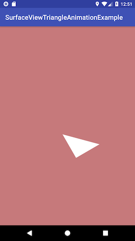

# SurfaceViewTriangleAnimationExample

This is a example to present how to create a animation view with SurfaceView.

Screenshot:

This source code is come from *Android UI Fundamentals*, written by **Jason Ostrander**.